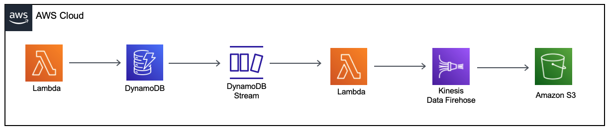

# Automatically archive items to Amazon S3 using DynamoDB TTL
#### AWS Lambda to Dynamodb to Kinesis Data Firehose to S3 

This pattern provides steps to remove older data from an Amazon DynamoDB table and archive it to an Amazon Simple Storage Service (Amazon S3) bucket on Amazon Web Services (AWS) without having to manage a fleet of servers.

This pattern uses Amazon DynamoDB Time to Live (TTL) to automatically delete old items and Amazon DynamoDB Streams to capture the TTL-expired items. It then connects DynamoDB Streams to AWS Lambda, which runs the code without provisioning or managing any servers.



The SAM template deploys two Lambda function, a DynamoDB table, a Kinesis Data Streams and an S3 bucket. 

AWS reference : https://docs.aws.amazon.com/prescriptive-guidance/latest/patterns/automatically-archive-items-to-amazon-s3-using-dynamodb-ttl.html

This is a Java 11 implementation of this pattern.

Important: this application uses various AWS services and there are costs associated with these services after the Free Tier usage - please see the [AWS Pricing page](https://aws.amazon.com/pricing/) for details. You are responsible for any AWS costs incurred. No warranty is implied in this example.

## Requirements

* [Create an AWS account](https://portal.aws.amazon.com/gp/aws/developer/registration/index.html) if you do not already have one and log in. The IAM user that you use must have sufficient permissions to make necessary AWS service calls and manage AWS resources.
* [AWS CLI](https://docs.aws.amazon.com/cli/latest/userguide/install-cliv2.html) installed and configured
* [Git Installed](https://git-scm.com/book/en/v2/Getting-Started-Installing-Git)
* [AWS Serverless Application Model](https://docs.aws.amazon.com/serverless-application-model/latest/developerguide/serverless-sam-cli-install.html) (AWS SAM) installed

## Deployment Instructions

1. Compile and package the java code
    ``` 
    mvn clean package
    ```
1. Create an S3 bucket where the source code will be stored
    ```
    aws s3 mb s3://qaxwf2r928sdjosaoiued
    ```
1. Copy the source code located in the target folder
    ```
    aws s3 cp target/sourceCode.zip s3://qaxwf2r928sdjosaoiued
    ```
1. Deploy the CloudFormation stack
    ```
    sam deploy --s3-bucket qaxwf2r928sdjosaoiued --stack-name ttl-pattern --capabilities CAPABILITY_IAM
    ```

## How it works

The Lambda function will put an record into the Kinesis Data Firehose.   
Kinesis Data Firehose will store the data as an object into an S3 bucket.   

## Testing
```
aws lambda invoke --function-name DataProducer response

```

Wait an hour or two and run the following command to see the record in S3
```
aws s3 ls s3://deliverybucket-hb8ud9812dsaasd --recursive --human-readable --summarize

aws s3 cp s3://deliverybucket-hb8ud9812dsaasd/OBJECT_NAME.gz download.gz

gunzip download.gz

cat download
```

## Cleanup

```
aws s3 rm s3://deliverybucket-hb8ud9812dsaasd --recursive

aws cloudformation delete-stack --stack-name ttl-pattern

aws s3 rm s3://qaxwf2r928sdjosaoiued --recursive

aws s3 rb s3://qaxwf2r928sdjosaoiued
```    
----

## Language:
This is a Maven project which uses Java 11 and AWS SDK.

## Framework

The framework used to deploy the infrastructure is SAM(AWS Serverless Application Model)

## Author bio
Razvan Minciuna  
Software Architect    
https://www.linkedin.com/in/razvanminciuna/ 

